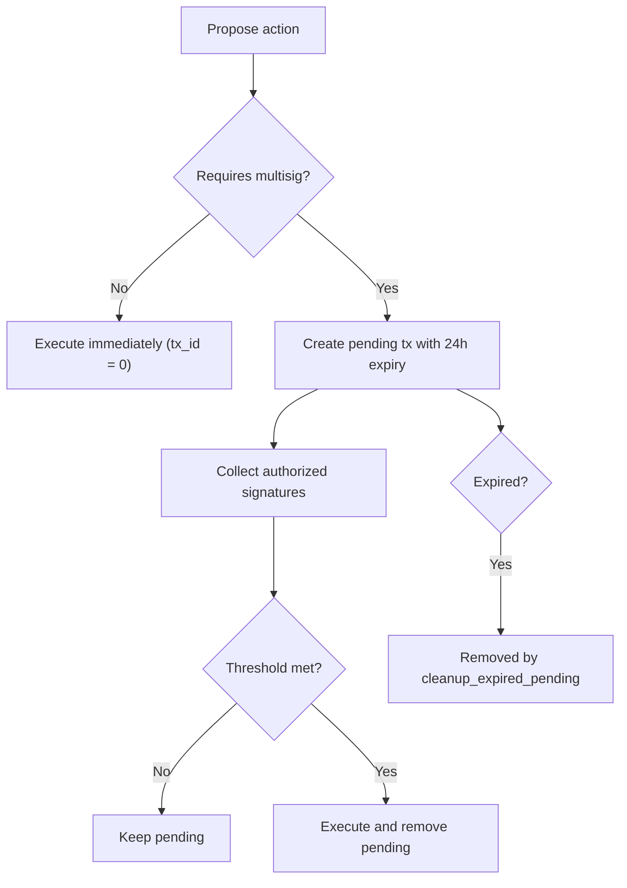
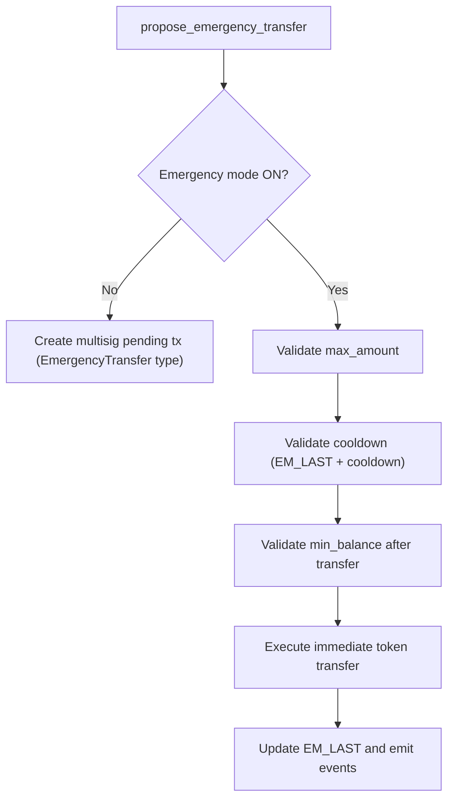

# Family Wallet Design (As Implemented)

This document describes the current `family_wallet` contract behavior as implemented in `family_wallet/src/lib.rs`.

## Purpose

`family_wallet` provides policy controls for shared-family spending:

- Role-based access control (`Owner`, `Admin`, `Member`, `Viewer`)
- Per-transaction spending limits
- Multi-signature approval flows for high-risk actions
- Emergency transfer mode with guardrails
- Pause, upgrade-admin, and audit utilities

The contract is policy and execution oriented; token transfers are executed from a proposer address to a recipient via Soroban token contract calls.

## Role Model

Role order is numeric and used for `require_role_at_least` checks:

- `Owner` (`1`)
- `Admin` (`2`)
- `Member` (`3`)
- `Viewer` (`4`)

Lower numeric value is higher privilege.

### Role Expiry

- Optional role expiry per member is stored in `ROLE_EXP`.
- Expired roles fail `require_role_at_least` checks (`"Role has expired"` panic).
- Expiry is set/cleared via `set_role_expiry`.

## Permissions Matrix

| Operation | Methods | Allowed caller | Key guards |
|---|---|---|---|
| Initialize wallet | `init` | Owner address passed to `init` | One-time only (`"Wallet already initialized"` panic) |
| Add member (strict) | `add_member` | Owner or Admin | Role cannot be `Owner`; rejects duplicates; spending limit must be `>= 0`; returns `Result` |
| Add member (legacy overwrite path) | `add_family_member` | Owner or Admin | Role cannot be `Owner`; overwrites existing member record; limit forced to `0` |
| Remove member | `remove_family_member` | Owner only | Cannot remove owner |
| Update per-member spending limit | `update_spending_limit` | Owner or Admin | Member must exist; new limit must be `>= 0`; returns `Result` |
| Configure multisig | `configure_multisig` | Owner or Admin | `threshold > 0`; `threshold <= signers.len()`; all signers must already be family members; spending limit must be `>= 0` |
| Propose transaction | `propose_transaction` and wrappers (`withdraw`, `propose_*`) | `Member` or higher | Caller must be family member; blocked when paused |
| Sign transaction | `sign_transaction` | `Member` or higher | Must be in configured signer list for tx type; no duplicate signature; not expired |
| Emergency config and mode | `configure_emergency`, `set_emergency_mode` | Owner or Admin | Emergency max amount `> 0`; min balance `>= 0` |
| Pause controls | `pause`, `unpause`, `set_pause_admin` | Pause admin (pause/unpause), Owner (`set_pause_admin`) | Default pause admin is owner unless overridden |
| Upgrade controls | `set_upgrade_admin`, `set_version` | Owner (`set_upgrade_admin`), upgrade admin (`set_version`) | Emits upgrade event on version change |
| Batch member operations | `batch_add_family_members`, `batch_remove_family_members` | Admin+ for add, Owner for remove | Max batch size enforced; cannot add/remove owner |
| Storage cleanup | `archive_old_transactions`, `cleanup_expired_pending` | Owner or Admin | Blocked when paused |
| Reads | `get_*`, `is_*` | Any caller | Read-only |

## Limits and Policy Rules

### Constants

| Name | Value | Meaning |
|---|---|---|
| `SIGNATURE_EXPIRATION` | `86400` seconds | Pending multisig transaction expiry (24h) |
| `MAX_BATCH_MEMBERS` | `30` | Maximum add/remove batch size |
| `MAX_ACCESS_AUDIT_ENTRIES` | `100` | Access audit ring size (last 100 retained) |
| `INSTANCE_BUMP_AMOUNT` | `518400` ledgers | Active-instance TTL extension target |
| `ARCHIVE_BUMP_AMOUNT` | `2592000` ledgers | Archive TTL extension target |

### Default Configs Set During `init`

- Multisig configs for `LargeWithdrawal`, `SplitConfigChange`, `RoleChange`, `EmergencyTransfer`, `PolicyCancellation`:
  - `threshold = 2`
  - `signers = []`
  - `spending_limit = 1000_0000000`
- Emergency config:
  - `max_amount = 1000_0000000`
  - `cooldown = 3600`
  - `min_balance = 0`
- Emergency mode disabled by default.

### Spending Limit Semantics

- `check_spending_limit`:
  - Unknown caller or negative amount => `false`
  - Owner/Admin => always `true`
  - Member/Viewer with limit `0` => unlimited (`true`)
  - Positive limit => `amount <= spending_limit`
- `withdraw` thresholding uses **multisig config for `LargeWithdrawal`**:
  - `amount <= spending_limit` => `RegularWithdrawal` immediate path
  - `amount > spending_limit` => `LargeWithdrawal` multisig path

## Key Flows

### 1. Withdrawal Flow

```mermaid
sequenceDiagram
    participant U as Proposer
    participant C as FamilyWallet
    participant T as Token
    participant S as Authorized Signer

    U->>C: withdraw(token, recipient, amount)
    C->>C: load LargeWithdrawal config
    alt amount <= config.spending_limit
        C->>T: transfer(proposer -> recipient, amount)
        C-->>U: tx_id = 0 (executed)
    else amount > config.spending_limit
        C->>C: create pending tx (auto-add proposer signature)
        C-->>U: tx_id > 0
        S->>C: sign_transaction(tx_id)
        alt signatures >= threshold
            C->>T: transfer(proposer -> recipient, amount)
            C->>C: remove pending; mark executed
        else waiting for more signatures
            C->>C: store updated pending signatures
        end
    end
```

### 2. Generic Multisig Governance Flow

Used by `propose_split_config_change`, `propose_role_change`, `propose_policy_cancellation`, and non-emergency-mode `propose_emergency_transfer`.



### 3. Emergency Transfer Flow



## Example Scenarios

### Scenario A: Small household transfer

1. Owner configures `LargeWithdrawal` spending limit to `1000_0000000`.
2. Owner withdraws `500_0000000` to a utility provider.
3. Since amount is below threshold, transfer executes immediately and returns `tx_id = 0`.

### Scenario B: Large transfer requiring approvals

1. Admin configures `LargeWithdrawal` as `threshold=3` with 5 signers.
2. Owner proposes a `2000_0000000` withdrawal.
3. Pending tx is created with proposer auto-signed.
4. Two additional authorized signers approve.
5. Transfer executes, pending entry is removed.

### Scenario C: Emergency payout during outage

1. Owner enables emergency mode and sets:
   - `max_amount = 2000_0000000`
   - `cooldown = 3600`
   - `min_balance = 1000_0000000`
2. Owner proposes `1500_0000000` emergency transfer.
3. Contract validates amount, cooldown, and residual balance; executes immediately.
4. A second transfer inside cooldown window is rejected.

## Storage Model

### Core instance keys

- `OWNER`: wallet owner
- `MEMBERS`: `Map<Address, FamilyMember>`
- `PEND_TXS`: `Map<u64, PendingTransaction>`
- `EXEC_TXS`: `Map<u64, bool>`
- `NEXT_TX`: next transaction id

### Policy keys

- `MS_WDRAW`, `MS_SPLIT`, `MS_ROLE`, `MS_EMERG`, `MS_POL`: multisig configs by transaction type
- `EM_CONF`, `EM_MODE`, `EM_LAST`: emergency controls
- `ROLE_EXP`: per-member expiry timestamps
- `PAUSED`, `PAUSE_ADM`: pause controls
- `UPG_ADM`, `VERSION`: upgrade controls

### Observability keys

- `ACC_AUDIT`: rolling access audit list
- `ARCH_TX`: archived executed tx metadata
- `STOR_STAT`: storage statistics snapshot

## Events and Frontend Consumption

Primary emitted events:

- `(added, member)` => `MemberAddedEvent`
- `(updated, limit)` => `SpendingLimitUpdatedEvent`
- `(emerg, ModeOn|ModeOff)` => emergency mode toggles
- `(emerg, TransferInit)` and `(emerg, TransferExec)` => emergency execution lifecycle
- `(wallet, TransactionsArchived)` and `(wallet, ExpiredCleaned)` => cleanup activity
- `(wallet, paused|unpaused|upgraded)` => operational/admin lifecycle

Frontend state handling recommendations:

- Treat `tx_id == 0` as synchronous completion.
- Treat `tx_id > 0` as pending multisig and poll `get_pending_transaction`.
- Use `cleanup_expired_pending` operationally to purge stale proposals.
- Handle both `Result` errors (for some methods) and panics (string-based failures) in client UX.

## Current Implementation Notes

These are important as-implemented behaviors:

- `add_member` is strict (duplicate-safe and limit-aware), while `add_family_member`/batch add overwrite records and force spending limit to `0`.
- `archive_old_transactions` archives all `EXEC_TXS` entries currently present; `before_timestamp` is written into archived metadata but not used as a filter.
- `SplitConfigChange` and `PolicyCancellation` transaction execution paths currently complete without cross-contract side effects.
- Token-transfer execution from `sign_transaction` path calls `proposer.require_auth()` for transfer types, so proposer authorization is required at execution time.
